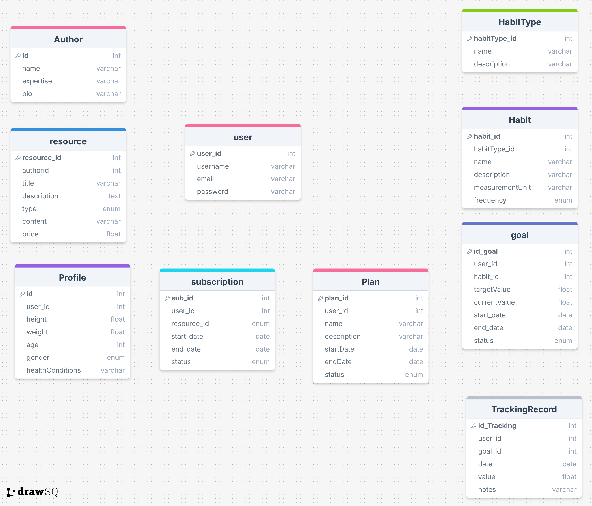

### Introducción

Nuestro proyecto consiste en el desarrollo de una aplicación web innovadora diseñada para ayudar a los usuarios a mejorar su bienestar a través del seguimiento de hábitos saludables, como la actividad física, la alimentación equilibrada, y la gestión del estrés. La plataforma permitirá a los usuarios establecer metas personalizadas, realizar un seguimiento de su progreso mediante gráficos intuitivos, y acceder a recursos adicionales proporcionados por expertos en salud.

El objetivo principal es crear una herramienta práctica y motivadora que facilite el desarrollo de hábitos saludables sostenibles en el tiempo, atendiendo las necesidades de personas que buscan mejorar su estilo de vida, pacientes que requieren un seguimiento constante, y comunidades interesadas en promover el bienestar colectivo. Además, la plataforma ofrecerá un espacio donde los expertos en salud puedan compartir contenido valioso, como artículos, videos y guías, y llegar a una audiencia más amplia.

### Colaboradores

| Nombre                             | Rol              | Perfil                                                                                     |
|------------------------------------|------------------|--------------------------------------------------------------------------------------------|
| Agreda Iparraguirre Rodrigo Imanol | Líder del proyecto | [LinkedIn](https://www.linkedin.com/in/rodrigo-agreda-iparraguirre-7b9429260/)             |
| Gilian Alayo Mario Sebastian       | Developer        | [LinkedIn](https://www.linkedin.com/in/mario-sebastian-gilian-alayo-b8b0042a4/)            |
| Alonso Vidal John Steven           | Developer        | [LinkedIn]()                                                                              |
| Carranza Jacinto Juan Diego        | Developer        | [LinkedIn](https://www.linkedin.com/in/juan-diego-carranza-jacinto-a78023329?utm_source=share&utm_campaign=share_via&utm_content=profile&utm_medium=android_app)                                                                              |
| Vilchez Zavaleta Edwin Valentino   | Developer        | [LinkedIn]()                                                                              |

### Funcionalidades

#### Módulos Principales:
1. **Módulo de Gestión de Usuarios**:
    - **Registro y Gestión de Perfiles**: Los usuarios podrán crear y gestionar sus perfiles, especificando sus objetivos de salud y preferencias. Esto incluye la capacidad de actualizar datos personales y ajustar metas a lo largo del tiempo.

2. **Módulo de Metas y Seguimiento**:
    - **Funcionalidades CRUD**: Permite a los usuarios establecer, registrar y modificar metas de salud, como alcanzar un cierto nivel de actividad física semanal o seguir una dieta equilibrada. Los usuarios podrán hacer un seguimiento de su progreso diario.

3. **Módulo de Reportes**:
    - **Visualización de Progreso**: Los usuarios podrán acceder a gráficos y estadísticas que muestran su progreso en relación con las metas establecidas, lo que les ayudará a mantenerse motivados y a ajustar sus objetivos según sea necesario.

4. **Módulo de Pagos en Línea**:
    - **Acceso a Recursos Adicionales**: Los usuarios podrán adquirir acceso a recursos adicionales proporcionados por expertos, como videos de ejercicios, recetas saludables, y guías para el manejo del estrés. Estos recursos pueden estar disponibles como servicios de suscripción o compras únicas dentro de la plataforma.

5. **Módulo de Recursos**:
    - **Acceso a Contenido**: Los usuarios tendrán acceso a una biblioteca de recursos, que incluirán artículos, videos y guías relacionadas con la salud y el bienestar. Este contenido puede ser generado por expertos en salud y estará diseñado para apoyar a los usuarios en sus metas de bienestar.

### Segmentos Objetivos:

- **Personas que desean mejorar su estilo de vida**: Usuarios que buscan establecer y mantener hábitos saludables a largo plazo.
- **Pacientes que requieren seguimiento continuo**: Usuarios que necesitan monitorear sus hábitos debido a condiciones crónicas y que buscan un apoyo constante.
- **Comunidades interesadas en el bienestar colectivo**: Grupos o comunidades que promueven un estilo de vida saludable y desean coordinar esfuerzos colectivos para mejorar su salud.

### Relación con Expertos:

- Aunque los expertos no son el segmento objetivo principal, su conocimiento es fundamental para asegurar que los recursos y recomendaciones en la plataforma sean precisos y efectivos. Los estudiantes deberán realizar reuniones con expertos en salud para diseñar el contenido y las funcionalidades adecuadas.
- Los expertos se benefician al recibir compensaciones por la creación de recursos exclusivos que se distribuyen a través de la plataforma, lo cual les permite ampliar su alcance y acceder a una audiencia más amplia.

## Diagramas de Aplicación
### Diagrama de clases:

### Diagrama de base de datos:
